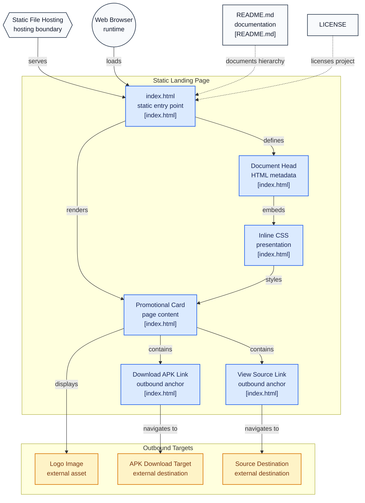

```mermaid
flowchart TD

subgraph group_static_page["Static Landing Page"]
  node_index["index.html<br/>static entry point<br/>[index.html]"]
  node_head["Document Head<br/>HTML metadata<br/>[index.html]"]
  node_inline_css["Inline CSS<br/>presentation<br/>[index.html]"]
  node_promo_card["Promotional Card<br/>page content<br/>[index.html]"]
  node_download_link["Download APK Link<br/>outbound anchor<br/>[index.html]"]
  node_source_link["View Source Link<br/>outbound anchor<br/>[index.html]"]
end

subgraph group_external["Outbound Targets"]
  node_logo["Logo Image<br/>external asset"]
  node_apk_target["APK Download Target<br/>external destination"]
  node_source_target["Source Destination<br/>external destination"]
end

node_browser(("Web Browser<br/>runtime"))
node_readme["README.md<br/>documentation<br/>[README.md]"]
node_license["LICENSE"]
node_static_host{{"Static File Hosting<br/>hosting boundary"}}

node_static_host -->|"serves"| node_index
node_browser -->|"loads"| node_index
node_index -->|"defines"| node_head
node_head -->|"embeds"| node_inline_css
node_index -->|"renders"| node_promo_card
node_inline_css -->|"styles"| node_promo_card
node_promo_card -->|"displays"| node_logo
node_promo_card -->|"contains"| node_download_link
node_promo_card -->|"contains"| node_source_link
node_download_link -->|"navigates to"| node_apk_target
node_source_link -->|"navigates to"| node_source_target
node_readme -.->|"documents hierarchy"| node_index
node_license -.->|"licenses project"| node_index

click node_index "[https://github.com/nexura-labs/apk-store/blob/main/index.html](https://github.com/nexura-labs/apk-store/blob/main/index.html)"
click node_head "[https://github.com/nexura-labs/apk-store/blob/main/index.html](https://github.com/nexura-labs/apk-store/blob/main/index.html)"
click node_inline_css "[https://github.com/nexura-labs/apk-store/blob/main/index.html](https://github.com/nexura-labs/apk-store/blob/main/index.html)"
click node_promo_card "[https://github.com/nexura-labs/apk-store/blob/main/index.html](https://github.com/nexura-labs/apk-store/blob/main/index.html)"
click node_download_link "[https://github.com/nexura-labs/apk-store/blob/main/index.html](https://github.com/nexura-labs/apk-store/blob/main/index.html)"
click node_source_link "[https://github.com/nexura-labs/apk-store/blob/main/index.html](https://github.com/nexura-labs/apk-store/blob/main/index.html)"
click node_readme "[https://github.com/nexura-labs/apk-store/blob/main/README.md](https://github.com/nexura-labs/apk-store/blob/main/README.md)"
click node_license "[https://github.com/nexura-labs/apk-store/blob/main/LICENSE](https://github.com/nexura-labs/apk-store/blob/main/LICENSE)"

classDef toneNeutral fill:#f8fafc,stroke:#334155,stroke-width:1.5px,color:#0f172a
classDef toneBlue fill:#dbeafe,stroke:#2563eb,stroke-width:1.5px,color:#172554
classDef toneAmber fill:#fef3c7,stroke:#d97706,stroke-width:1.5px,color:#78350f
classDef toneMint fill:#dcfce7,stroke:#16a34a,stroke-width:1.5px,color:#14532d
classDef toneRose fill:#ffe4e6,stroke:#e11d48,stroke-width:1.5px,color:#881337
classDef toneIndigo fill:#e0e7ff,stroke:#4f46e5,stroke-width:1.5px,color:#312e81
classDef toneTeal fill:#ccfbf1,stroke:#0f766e,stroke-width:1.5px,color:#134e4a
class node_index,node_head,node_inline_css,node_promo_card,node_download_link,node_source_link toneBlue
class node_logo,node_apk_target,node_source_target toneAmber
class node_browser,node_readme,node_license,node_static_host toneNeutral
```
